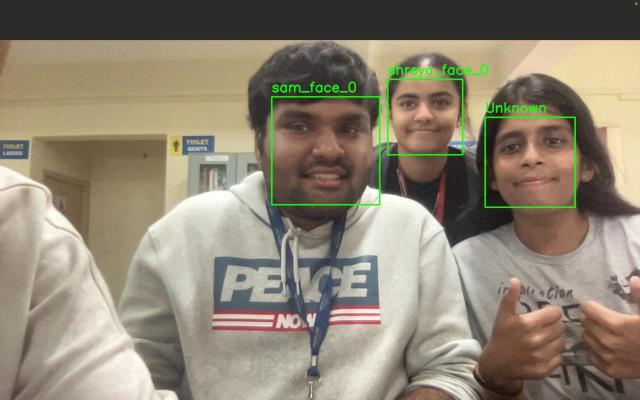

# Realtime_face_recognition_attedance_system

This project implements a **Facial Recognition Attendance System** using Python, OpenCV, Dlib, and other machine learning libraries to automate attendance processes for educational institutions. It significantly reduces manual work, minimizes errors, and provides real-time updates for administrators and faculty.

## Table of Contents
- [Project Overview](#project-overview)
- [Features](#features)
- [Technologies Used](#technologies-used)
- [System Architecture](#system-architecture)
- [Installation](#installation)
- [Usage](#usage)
- [Snapshots](#snapshots)
- [Results and Discussion](#results-and-discussion)
- [Future Enhancements](#future-enhancements)
- [Contributors](#contributors)
- [License](#license)

## Project Overview
The **Facial Recognition Attendance System** is designed to automate the attendance marking process by leveraging advanced facial recognition techniques. This system captures real-time video feed, processes images for facial recognition, and stores attendance records in a **MySQL** database. It enhances both the accuracy and efficiency of attendance management.

### Abstract
Traditional attendance systems are often time-consuming and prone to errors. This project integrates facial recognition technology to automate the attendance system, improving the process significantly. With over 95% recognition accuracy, the system ensures reliable attendance tracking, making it ideal for large-scale educational or corporate environments.

## Features
- **Automated Attendance**: Uses real-time facial recognition for attendance marking.
- **High Accuracy**: Achieves 95% accuracy through deep learning techniques.
- **User Management**: Simple interface for student registration and attendance tracking.
- **Real-Time Updates**: Provides instant feedback to users upon successful attendance logging.
- **Data Storage**: Attendance records are stored in a MySQL database, and snapshots of the attendance are saved in CSV files.

## Technologies Used
- **Programming Languages**: Python, JavaScript
- **Libraries**: OpenCV, Dlib, face_recognition, MySQL, HTML/CSS
- **Machine Learning**: Deep learning models for facial recognition
- **Frontend**: HTML, CSS, JavaScript
- **Backend**: Node.js with Express.js framework
- **Database**: MySQL

## System Architecture
The system follows a client-server architecture:
- **Client**: The frontend is developed with HTML, CSS, and JavaScript for an intuitive user interface. 
- **Server**: A Node.js server with Express.js manages backend operations, facial recognition processing (Python), and interaction with the MySQL database.
- **Database**: A MySQL database stores user information and attendance records.

## Installation

1. **Clone the repository**:
    ```bash
    git clone https://github.com/your-username/facial-recognition-attendance-system.git
    cd facial-recognition-attendance-system
    ```

2. **Install dependencies**:
    Install required Python packages:
    ```bash
    pip install -r requirements.txt
    ```
    Install required Node.js dependencies:
    ```bash
    npm install
    ```

3. **Set up MySQL**:
   - Create a MySQL database and update the connection string in the configuration file.

4. **Run the application**:
    ```bash
    python app.py
    npm start
    ```

## Usage
1. **Login Page**: Users input their credentials to access the system.

   
2. **Dashboard**: The dashboard provides an overview of classes, students, and allows administrators to take attendance.

   
3. **Take Attendance**: When the "Take Attendance" button is clicked, the camera captures an image, and the system recognizes faces.
    

4. **Attendance Logging**: Once a match is found, the system logs the attendance and stores the details in the MySQL database.
   

## Snapshots
- **Login Page**:  
  

- **Dashboard**:  
  

- **Student Details**:  
  

- **Camera to take attendance**:  
  

  
- **Attendance Marked**:  
  

## Results and Discussion
- **Recognition Accuracy**: Achieved 95% accuracy in facial recognition through extensive testing.
- **Processing Speed**: The system processes an image and recognizes an individual within 2 seconds.
- **User Feedback**: Positive user feedback regarding the simplicity and efficiency of the interface.

## Future Enhancements
- **Additional Biometrics**: Integrating fingerprint or iris recognition for multi-factor authentication.
- **Mobile Application**: Developing a mobile app for attendance tracking and monitoring.
- **IoT Integration**: Incorporating IoT for enhanced real-time data collection.

## Contributors
- **Sinchana HR** (Developer)
- **Shreya CS**
- **Shreya Mannapur**
- **Sambhram Suresh**

## License
This project is licensed under the MIT License - see the [LICENSE](LICENSE) file for details.
